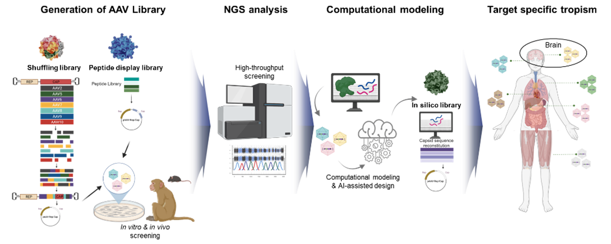
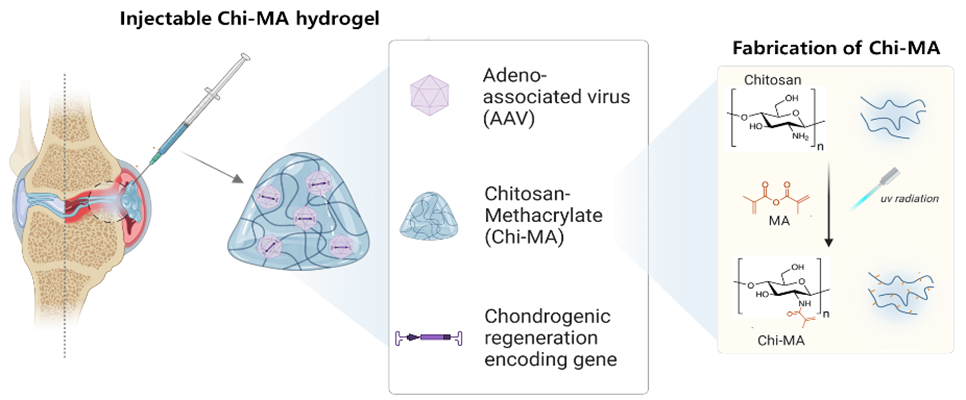

## 📊 자기 소개 (Introduction)
------

### 유전자 및 세포 치료제 개발 10년차 연구원 지은현입니다.

“ 바이러스 벡터, 줄기세포, 바이오소재 기반 치료 전략을 통해 환자의 삶을 변화시키는 연구에 집중해 왔으며, 
  최근에는 생명과학적 이해를 데이터 사이언스로 연결하는 융합적 접근을 통해 정밀 의료와 치료제 개발의 가능성을 확장하고 있습니다"

> 실험 : Virus vector engineering, Virus production, Gene & Cell therapy development, 
>        Stem cell engineering, Molecular & Cell Biology Techniques
> 
> 프로그래밍 : Python (pandas, numpy, scikit-learn, pytorch, matplotlib), SQL, Excel, Git
> 협업 : Git, Notion

## 📊 직무 경험 (Experience)
------

**전임연구원** @ 아밀로이드솔루션  (2020 - 2021)

- 중추신경계 (CNS) 유전자 치료제 개발을 위한 AAV 벡터 개발 프로젝트를 주도
    - 유도진화 기법 (directed evolution)을 활용해 새로운 벡터 후보군을 도출
- DNA 셔플링 및 펩타이드 삽입/치환 기술을 적용하여 AAV 라이브러리를 구축
    - 고효율 CNS 타깃 전달체 개발 기반 마련
 
**전임연구원** @ 에스엘바이젠  (2016 - 2018)

- 희귀 신경퇴행성 질환 및 암 치료를 위한 유전자·세포치료제 후보물질 스크리닝 및 특성 평가
    - 10건 이상의 후보물질에 대한 *in vitro* 효능 검증 완료
- 렌티바이러스를 활용하여 기능성 유전자가 탑재된 중간엽 줄기세포(MSC) 플랫폼 구축
- CNS 및 유전자 치료제의 임상시험계획(IND) 승인 신청에서 
  국내외 규제 기관의 요구 사항을 충족한 허가 문서 작성 및 대응 업무 수행

**연구원** @ 연세대학 줄기세포연구센터  (2015 - 2016)

- 신경 분화 유도 기반 줄기세포 치료제 개발 연구 수행
    - 척수 손상 치료 목적의 세포 치료 플랫폼 기초 기술 확립
- 바이러스 및 episomal 벡터 시스템을 활용한 유도만능줄기세포 확립
    - 다양한 세포 치료제 파이프라인 구축을 위한 기초 자료 확보

## 📊 교육 (Education)
------
🏫 **Ph.D. in Chemical Engineering & Materials Science** (2021 - 2025)
 - Ewha Womans University
 - Thesis: "Engineering AAV-Based Gene Therapy and Stem Cell Delivery via Functional Biomaterials for CNS Regeneration and Cancer Therapy”

🏫 **M.S. in Medical Sciences** (2013 - 2015)
 - Yonsei University
 - Thesis: "The role of CIIA gene in cellular reprogramming"
🏫 **B.S. in Biotechnology and Bioinformatics** (2007 - 2013)
 - Korea University

## 📊 프로젝트 (Project)
------

**[딥러닝: 뇌질환 약물 AAV 전달체]**
- 딥러닝을 이용해 뇌로 약물을 안전하게 전달할 수 있는 유전자 운반체를 개발한 연구

**[머신러닝: 골관절염 약물 AAV-ChiMA 전달구조체]**
- 머신러닝으로 연골 재생에 효과적인 AAV 캡시드를 설계하고, 
  이를 하이드로겔을 이용해 안정적으로 전달하여 골관절염 치료에 활용한 연구
